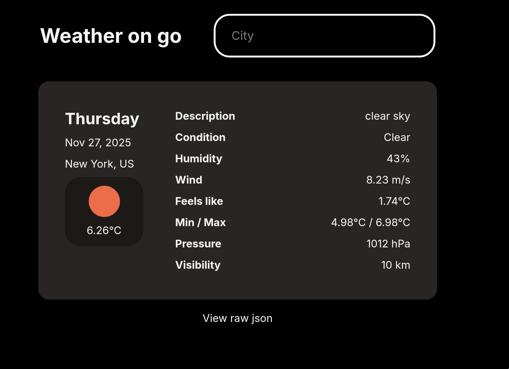
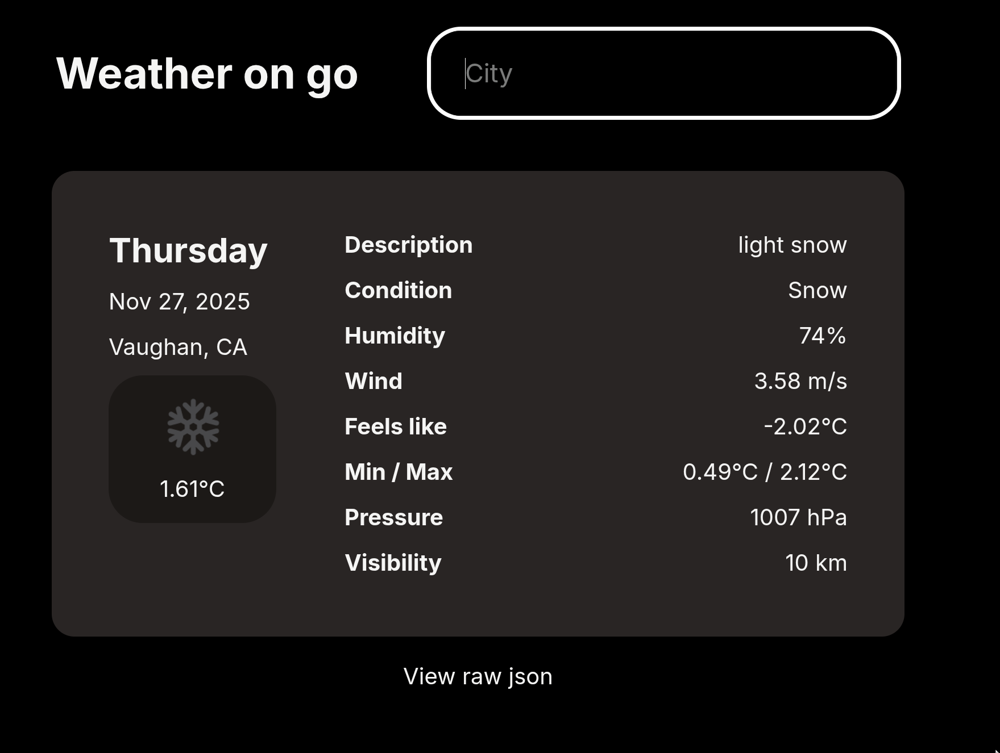
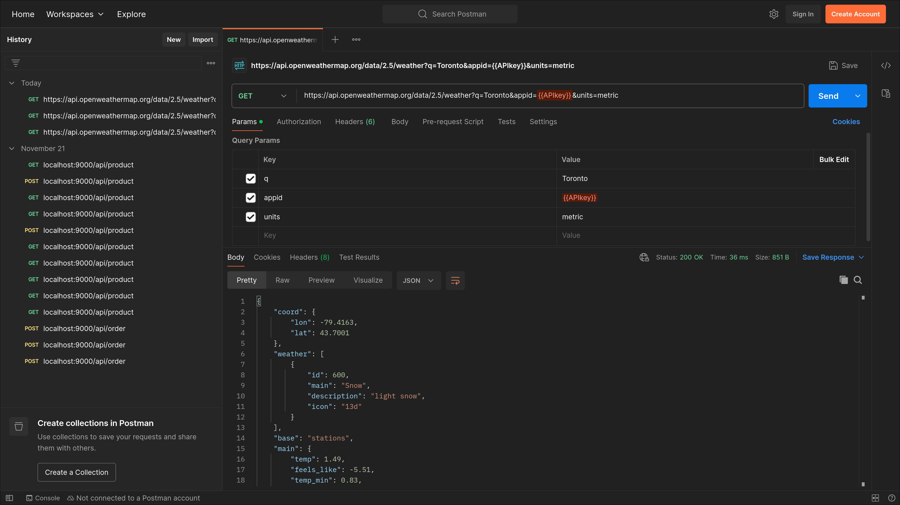

# 101482699_comp3123_labtest2

## Project Description

A React application built with Vite and Tailwind CSS.

## Setup Steps

1. Clone the repository
2. Install dependencies:
   ```
   npm install
   ```
3. Run development server:
   ```
   npm run dev
   ```
4. Build for production:
   ```
   npm run build
   ```

5. Add your `VITE_OPENWEATHER_KEY` in `.env`

## Screenshots

### New York Screenshot


### Vaughan Screenshot


### Postman


## Tech Stack

- React 19.2.0
- Vite 7.2.4
- Tailwind CSS 4.1.17

## Improvements
- Use TanStack query instead of useEffect which is not a good practice

## Notes and Assumptions

- Configured with Prettier Tailwind plugin for consistent code formatting
- Development and production builds handled through Vite
- Assumes metric units

# Inspired by the one I use on my phone :)

https://github.com/breezy-weather/breezy-weather
